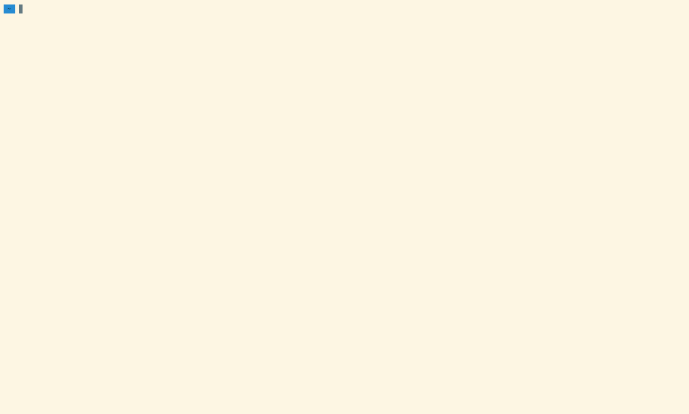

# minicloze
A command-line cloze-based language-learning game using the Tatoeba database of sentences. Written in Rust. The name is a reference to the Clozemaster app. This repository contains the Cargo workspace for minicloze.

# Features
- Support for over 400 languages
- Lookup unfamiliar words on Wiktionary
- Support for MacOS, Linux and Windows
- Lean implementation, written in pure Rust

# Targets
- **Long-term**
- Build a FOSS version of Clozemaster
- **Short-term**
- Learn 100, 1000 etc. most common words of various languages
- Play between two non-English languages

# Installation
To install `minicloze-cli`, the only currently supported frontend, use `cargo install minicloze` (more likely to be up-to-date) or just download a release.

# Usage
For `minicloze-cli`, just pass in the language (from www.tatoeba.org) you want to use, e.g. `minicloze french`. Add `inverse` for inverse mode (`minicloze french inverse`).

# Contributing
Any help is very welcome, just open a PR or an issue and I'll probably be able to reply quickly. Right now the focus is on expanding from the basic idea into a more fully-fledged and user friendly experience.

# Tatoeba Licensing
All sentences are from Tatoeba (www.tatoeba.org). Tatoeba's data is released under the CC-BY 2.0 FR license.
